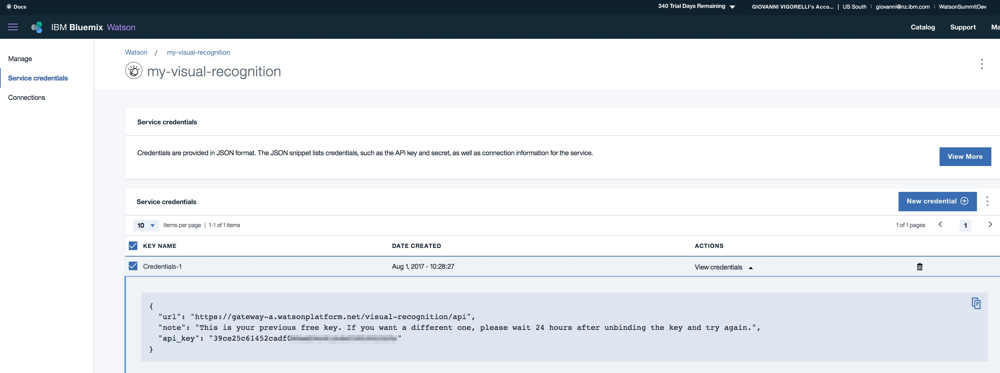

# Watson Visual recognition - 📷 - usage samples via command line (CURL)
 
This document cover different use cases for using Watson Visual Recognition.
Several pictures are used in the documentation, those pictures won't be available in the repository for possible copyrights.
A simple and quick way to collect many images on the same subject is to use 'image' tab in Google. There are several browser pluging to bulk download images from a web site.

Prerequites to run through the scenario is having an instance of Visual Recognition. The service is available as service in IBM Bluemix. It has a free tier that allows everybody to experiment with the service.
Once the service is created in Bluemix it's fundamental to get service credential (api_key)

  
  

Let's start with the usage scenario

## Classify an image using 'default' classifier.

  1. Go to [https://console.ng.bluemix.net/](https://console.ng.bluemix.net/)
  2. Create a Bluemix account if required.
  3. Log in with your IBM ID (the ID used to create your Bluemix account)

**Note:** The confirmation email from Bluemix mail take up to 1 hour.

Leveraging the IBM Bluemix DevOps Services, we are able to quickly clone the code from any public GitHub repository, create the dependent Watson service instances, and deploy our application code with the click of a button.  To get started:

  1. Click the button below to fork the project into IBM DevOps Services and deploy your own instance of this application on [IBM Bluemix][bluemix].

``` sh
curl -X GET "https://gateway-a.watsonplatform.net/visual-recognition/api/v3/classify?api_key={api_key}&url=https://github.com/watson-developer-cloud/doc-tutorial-downloads/raw/master/visual-recognition/fruitbowl.jpg&version=2016-05-19&classifier_ids={classifier_id},default"
```
