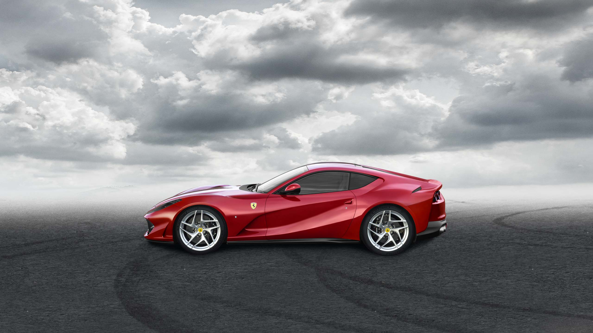

# Watson Visual Recognition - usage samples via command line (CURL)
 
This document cover different use cases for using Watson Visual Recognition.
Several pictures are used in the documentation, those pictures won't be available in the repository for possible copyrights.
A simple and quick way to collect many images on the same subject is to use 'image' tab in Google. There are several browser pluging to bulk download images from a web site.

Prerequites to run through the scenario is having an instance of Visual Recognition. The service is available as service in IBM Bluemix. It has a free tier that allows everybody to experiment with the service.
Service home page with documentation and online demo) is available at this URL:  
https://www.ibm.com/watson/services/visual-recognition/

In the same page is possible to find a link to the APIs. We will use APIs extensively.  
https://www.ibm.com/watson/developercloud/visual-recognition/api/v3/  
https://watson-api-explorer.mybluemix.net/apis/visual-recognition-v3?cm_mc_uid=11860889192715021454544&cm_mc_sid_50200000=1502274040&cm_mc_sid_52640000=


Once the service is created in Bluemix it's fundamental to get service credential (api_key)

  
  
Working from bash command line is handy to create variables and use them from other commands. 
From service credential copy the api_key value and export into api_key variable.

``` sh
$ export api_key="39ce25c61452cadfXXXXXXXXXXXXXXXXXXX"
$ echo ${api_key}
39ce25c61452cadfXXXXXXXXXXXXXXXXXXX 
```

Let's start now with the usage scenarios


## Classify an image using 'default' classifier.

In this scenario we are going to use the default classifier and passing a random image from internet.
For convenience we will store the URL into a variable as we did with the api_key.

  

``` sh
$ export image_url=http://static.812superfast.ferrari.com/includes/20170309/img/50.pages.01.homepage/03.Exterior-design/01/152m-laterale-2560.jpg
```  
and then we will invoke the API  
**Note:**  use double quote in CURL

``` sh
$ curl -X GET "https://watson-api-explorer.mybluemix.net/visual-recognition/api/v3/classify?url=${image_url}&api_key=${api_key}&classifier_ids=default&version=2016-05-20"
Request URL
```

The result gives us already a lot of information about the picture:

```
{
    "custom_classes": 0,
    "images": [
        {
            "classifiers": [
                {
                    "classes": [
                        {
                            "class": "sports car",
                            "score": 0.768,
                            "type_hierarchy": "/vehicle/wheeled vehicle/car/sports car"
                        },
                        {
                            "class": "car",
                            "score": 0.924
                        },
                        {
                            "class": "wheeled vehicle",
                            "score": 0.949
                        },
                        {
                            "class": "vehicle",
                            "score": 0.949
                        },
                        {
                            "class": "sedan",
                            "score": 0.534,
                            "type_hierarchy": "/vehicle/wheeled vehicle/car/sedan"
                        },
                        {
                            "class": "motor vehicle",
                            "score": 0.533,
                            "type_hierarchy": "/vehicle/wheeled vehicle/motor vehicle"
                        },
                        {
                            "class": "body (of vehicle)",
                            "score": 0.527
                        },
                        {
                            "class": "roadster",
                            "score": 0.524,
                            "type_hierarchy": "/vehicle/wheeled vehicle/car/roadster"
                        },
                        {
                            "class": "coupe car",
                            "score": 0.5,
                            "type_hierarchy": "/vehicle/wheeled vehicle/car/coupe car"
                        },
                        {
                            "class": "maroon color",
                            "score": 0.752
                        },
                        {
                            "class": "claret red color",
                            "score": 0.584
                        }
                    ],
                    "classifier_id": "default",
                    "name": "default"
                }
            ],
            "resolved_url": "http://static.812superfast.ferrari.com/includes/20170309/img/50.pages.01.homepage/03.Exterior-design/01/152m-laterale-2560.jpg",
            "source_url": "http://static.812superfast.ferrari.com/includes/20170309/img/50.pages.01.homepage/03.Exterior-design/01/152m-laterale-2560.jpg"
        }
    ],
    "images_processed": 1
}
```
  
  
  BOOKMARK
